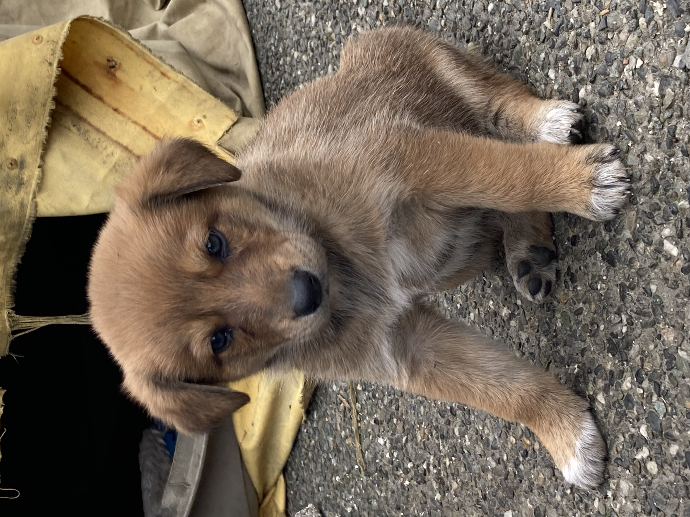
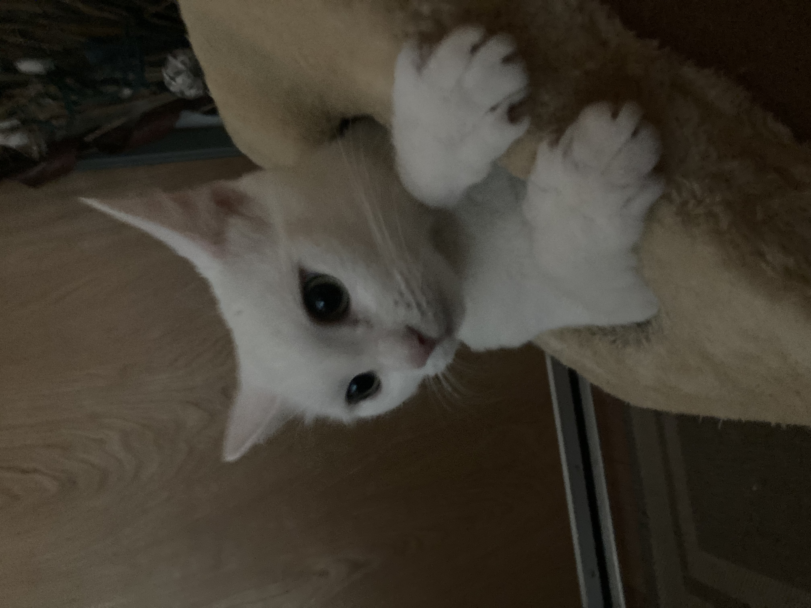
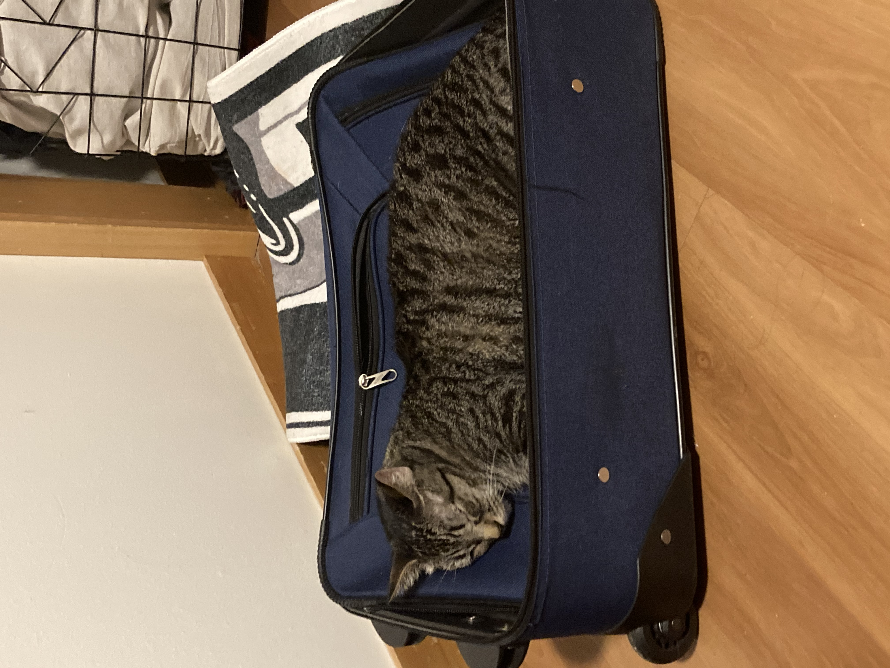

<h1 align="center">Zero</h1>

<i>i work on iphones, cars, and whatever else has a board in it.</i>

  

---

### about
- 📍 based in **Washington** — it rains basically every day, except in the summer season it doesnt rain at all
- 🔧 i build iphones from scratch out of parts, not just screen swaps
- 🚗 into cars just as much as tech
- 🚫 i will not touch a android, ever
- 🧊 first repair: iphone 6s when i was age 8-10, after throwing it at a wall and ripping the screen cable and swapped the cable out no problem
- 🥤 fav drinks: baja blast, monster, water, and jarritos
- 🎤 i once hijacked my school's PA system on April Fools because yes

### currently on the bench
- iPod Classic (5th gen) — bringing it back to life, needs a new battery
- iPhone SE (2nd gen) — stripping for parts
- MacBook — EFI locked, deciding between parting it out or programming the lock chip
- iPad — MDM locked, i can prob get thru this once i get a vm for macOS because i need MDM Patcher or legacy kit
- Brickverse — goated roblox revival 2016-2021 revival and im still working on it with dxo

---

### the crew

  
  
  

ruby &nbsp;•&nbsp; nieve &nbsp;•&nbsp; ella

---

### code languages

  
  
  
  
  

  
  
  

---

### stats

  
  

  

---

  
  
  
  

